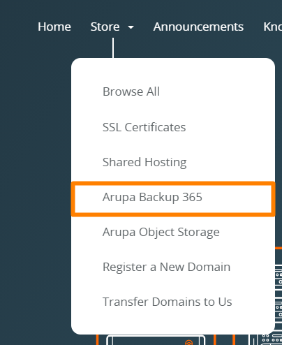
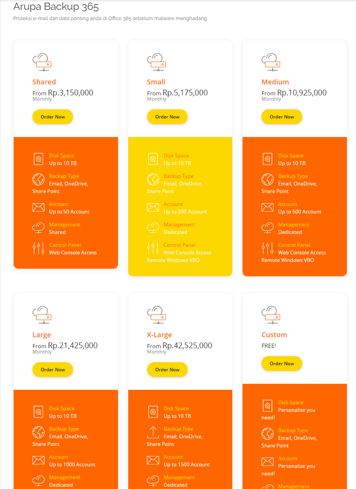
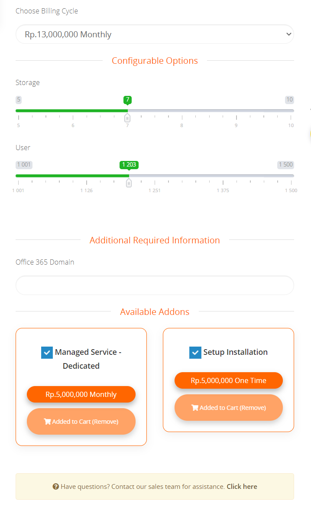
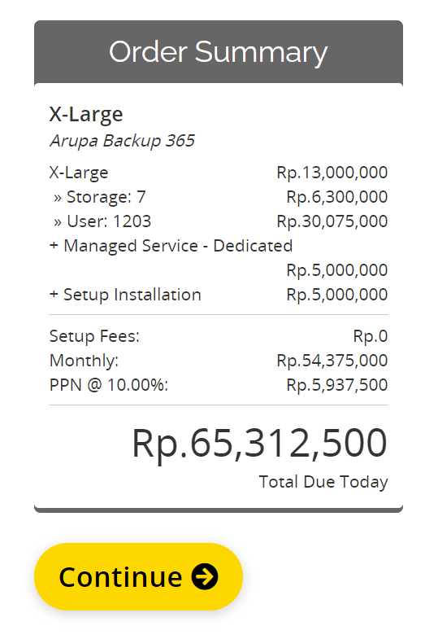
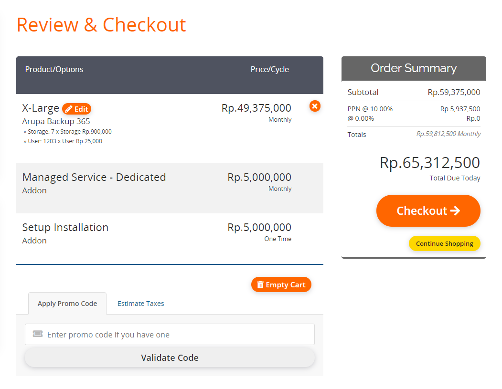
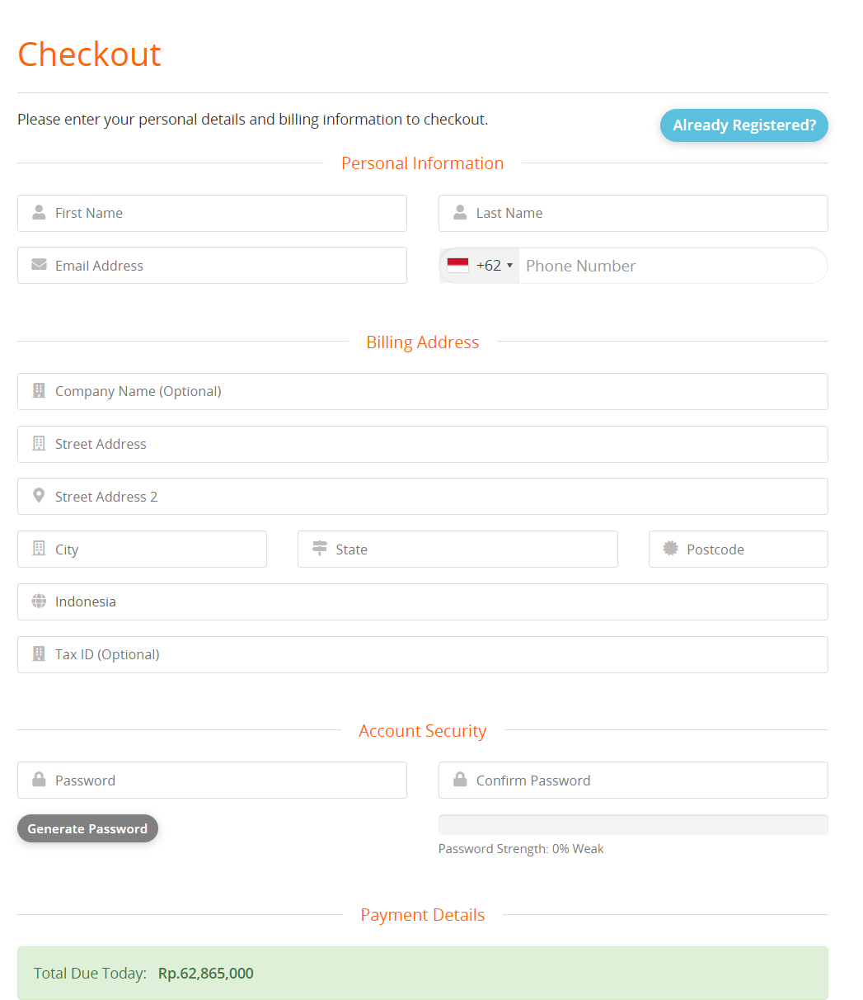
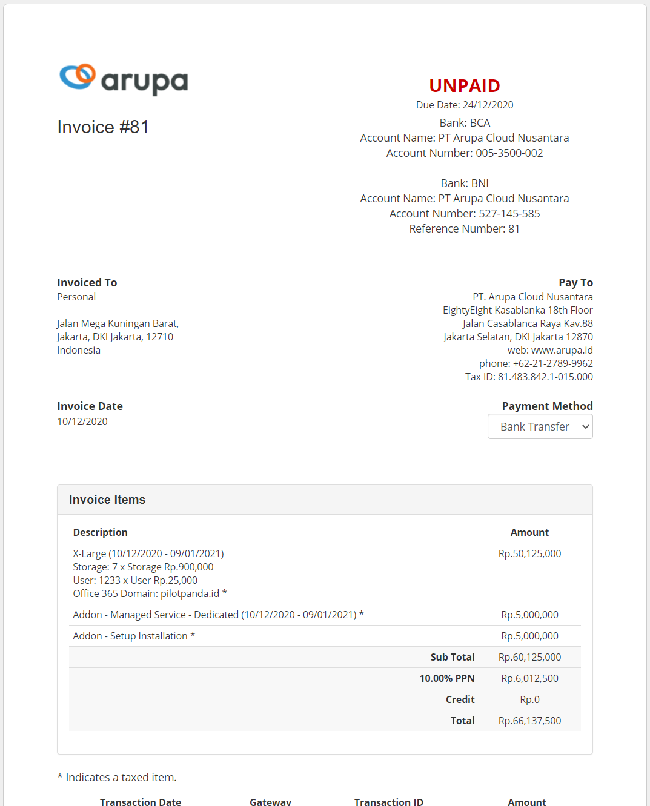
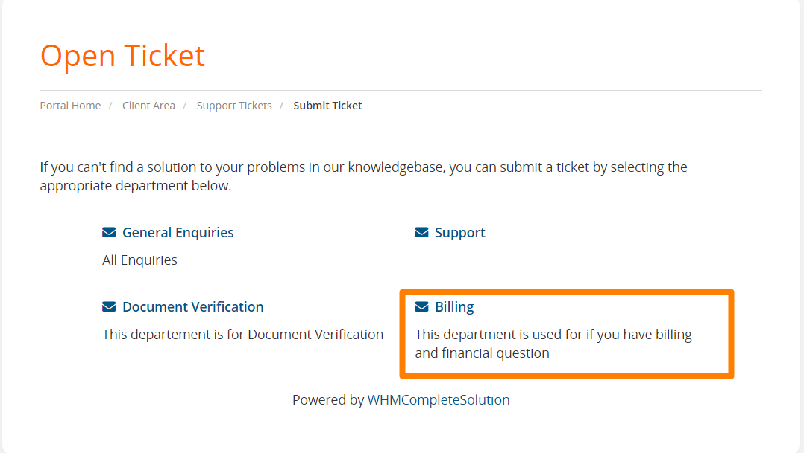
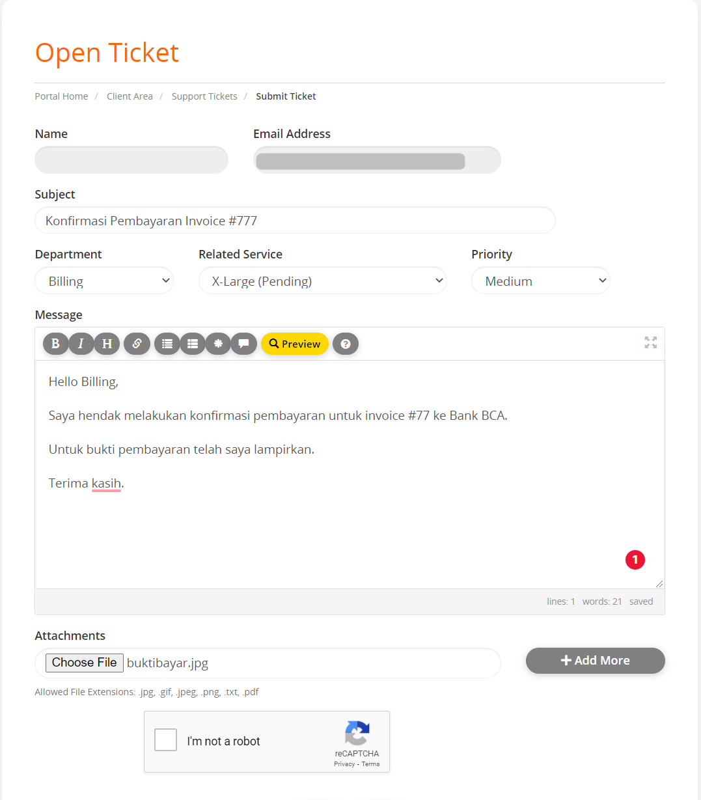

## Pemesanan Layanan

1. Silahkan mengunjungi store.arupa.id lalu menuju tab Store > Arupa Backup 365 

2. Silahkan pilih paket yang sesuai dengan kebutuhan anda, Jika telah menemukan paket yang sesuai dengan kebutuhan Anda selanjutnya klik “Order Now”

3. Selanjutnya bisa disesuikan untuk Storage dan User sesuai dengan kebutuhan dengan cara mengeser slider yang tersedia. Untuk domain dapat diisikan untuk office 365 Domain yang Anda miliki. Pada menu Add On terdapat dua pilihan extra layanan yaitu Managed Service dan Setup Installation untuk Add On ini dapat Anda pilih jika membutuhkan layanan tambahan.

4. Setelah mengisi form konfigurasi selanjutnya dapat memilih “Continue”

5. Silahkan review terlebih dahulu untuk konfigurasi, Setelah sesuai bisa klik Checkout 

6. Selanjutnya dapat diisikan untuk informasi detail berikut 

?> _FYI_ Jika telah memiliki akun pada arupa.id dapat memilih "Already Registered"

?> _FYI_ Jika telah memiliki akun pada arupa.id dapat memilih "Already Registered"

7. Setelah selesai melakukan pengisian bisa klik “Complete Order” dan akan muncul Invoice pembayaran 

8. Untuk pembayaran dapat mengisikan berita sesuai nomor invoice, Setelah selesai melakukan pembayaran dapat mengirimkan ticket untuk konfirmasi pembayaran dengan membuka support ticket dengan mengklik “Open Ticket” lalu memilih “Billing Support”

?> _FYI_ Untuk konfirmasi pembayaran juga dapat melalui link berikut : https://store.arupa.id/submitticket.php?step=2&deptid=4

9. Pada saat open Ticket pada Related Service dapat dipilih service yang dibeli sebelumnya dan pada Attachment bisa dilampirkan untuk bukti bayar.

10. Setelah ticket diterima oleh tim Billing, Pembayaran akan diproses sekitar …..-….. Menit dan service akan diproses oleh Tim Support akan diproses sekitar ….Menit, Setelah service aktif tim Support akan mengirimkan email untuk informasi login detail.

